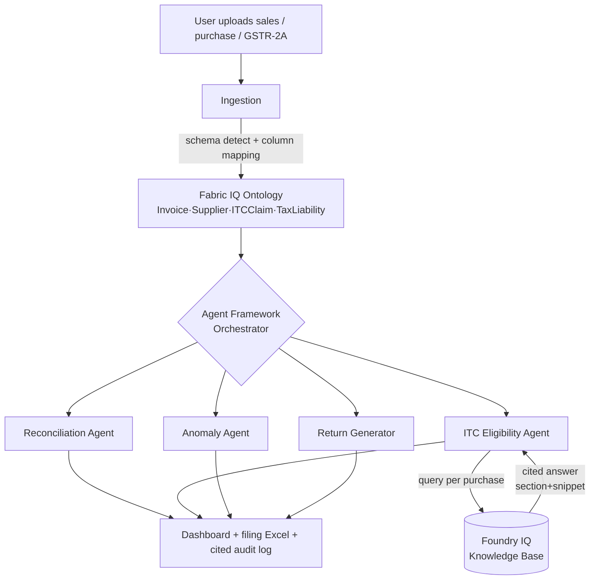
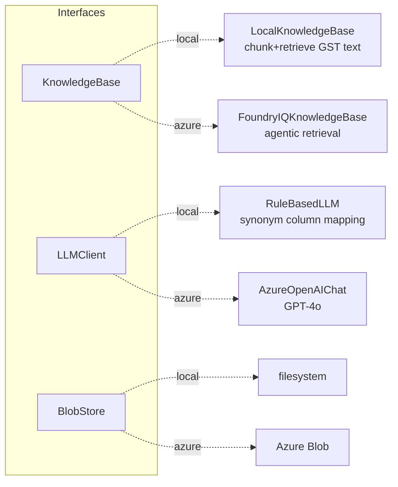

# TaxMind — Architecture

## Design goals

1. **Make the IQ integration visible.** Every compliance flag must surface a
   retrieved, cited GST Act reference. This is the single most important property
   of the system — it is what separates TaxMind from "Excel piped into an LLM".
2. **Reason in GST language.** A typed business ontology (Fabric IQ–style) sits
   between raw spreadsheet columns and the agents.
3. **Run today, upgrade to Azure later.** A provider abstraction lets the identical
   agent code run key-free (local) or against real Foundry IQ + Azure OpenAI.
4. **Human in the loop, fully auditable.** TaxMind prepares; a person files. Every
   decision is logged with its source.

## System flow

## Provider abstraction (the key decision)

Two interchangeable implementations sit behind each external dependency, selected
at runtime by `TAXMIND_MODE` (auto-detected from `.env`):

Both `KnowledgeBase` implementations return the same `KnowledgeResult`
(`answer`, `citations[]`, `confidence`, `backend`). Agents, the audit log, and the
frontend are oblivious to which backend served the answer — so the cited-decision
demo works identically in both modes, and switching is a config change, not a
rewrite. The Azure adapters also **degrade gracefully** to local on a runtime
error, keeping a live demo resilient.

Files:
- `backend/config.py` — mode auto-detection.
- `backend/foundry_iq/{base,local,foundry,factory}.py` — knowledge layer.
- `backend/llm/{base,rule_based,azure_openai,factory}.py` — LLM layer.

## The four agents

| Agent | File | What it does | Cited? |
|---|---|---|---|
| Reconciliation | `agents/reconciliation.py` | Match purchases ↔ GSTR-2A by GSTIN+invoice, tolerance compare, compute ITC at risk | — |
| ITC Eligibility | `agents/itc_eligibility.py` | Screen each purchase for Section 17(5) categories, **ground + cite via knowledge base**, defer to CA if unsure | ✅ |
| Anomaly Detection | `agents/anomaly_detection.py` | Duplicates, missing/invalid GSTIN, future-dated | — |
| Return Generator | `returns/generator.py` | GSTR-1 (B2B/B2C/HSN) + GSTR-3B (ITC available/reversed, net payable) | — |

The orchestrator (`agents/orchestrator.py`) runs them as a deterministic sequence;
`agents/agent_framework_workflow.py` expresses the same sequence as a Microsoft
Agent Framework workflow of `Executor` steps (used when `agent-framework` is
installed, with automatic fallback).

## Safety & reliability
- **Confidence floor** (`foundry_iq/base.py::CONFIDENCE_FLOOR`): below it, the ITC
  agent emits an "uncertain — consult a CA" decision instead of a block.
- **Audit log** (`audit/log.py`): every decision, the agent that made it, and its
  citation.
- **No auto-submission**: the API exposes preparation only; `auto_submit: false`.
- **Data hygiene**: synthetic demo data; only public GST Act text committed; `.env`
  git-ignored.
