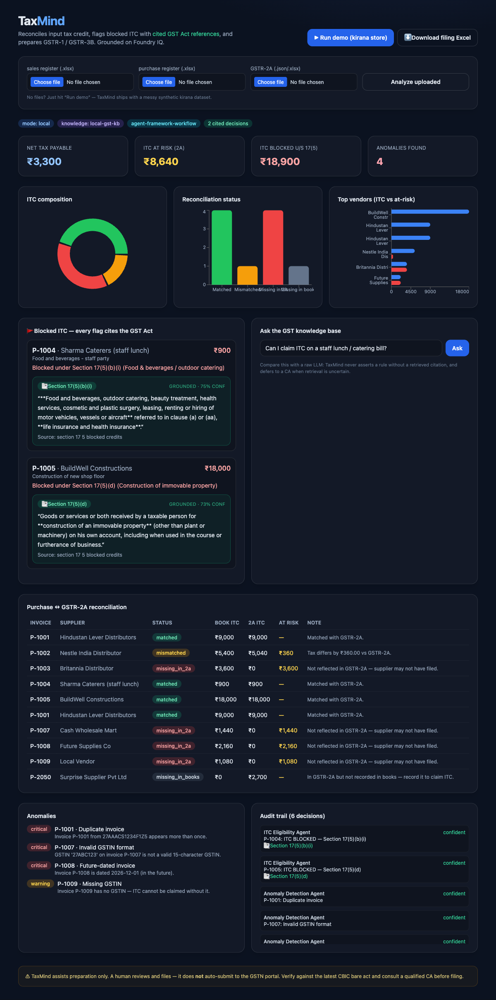

# TaxMind 🧾

**An AI agent that reads messy Excel sheets, reconciles input tax credit (ITC), flags risky invoices with _cited GST Act references_, and generates GSTR-1 / GSTR-3B–ready summaries for Indian small businesses.**

> 🏆 Built for the **Microsoft Agents League** hackathon — *Enterprise Agents* track.
> Grounded on **Foundry IQ** (knowledge base + agentic retrieval), orchestrated with the
> **Microsoft Agent Framework**, and reasoning over a **Fabric IQ–style business ontology**.

### 🎥 Demo
**[▶ Watch the demo video](https://youtu.be/k1cs11BciXk)** — messy Excel → reconciliation → cited Section 17(5) flags → filing-ready GSTR-1 / GSTR-3B.



---

## The problem

A small Indian business spends **days every month** on GST filing — manually
reconciling invoices in Excel, chasing ITC mismatches against GSTR-2A, and paying
a CA ₹2,000–5,000 just to prepare GSTR-1 and GSTR-3B. Mistakes are costly: claim a
**blocked credit** under Section 17(5) and you risk interest, penalties, and
notices.

## What TaxMind does

Upload your sales register, purchase register, and GSTR-2A. TaxMind:

1. **Ingests messy Excel** — misaligned columns, mixed date formats, Hindi *or*
   English headers — and maps it onto a GST business ontology.
2. **Reconciles** purchases against GSTR-2A (matched / mismatched / missing) and
   computes **ITC at risk**.
3. **Flags blocked ITC** under Section 17(5) — and *every flag carries the exact
   cited GST Act section + snippet* retrieved from the knowledge base.
4. **Detects anomalies** — duplicates, missing/invalid GSTINs, future-dated invoices.
5. **Generates GSTR-1 & GSTR-3B summaries** and a **filing-ready Excel** workbook.
6. Keeps a **human in the loop** — TaxMind prepares; it never auto-submits to GSTN.

Every compliance decision lands in an **audit trail** with its source citation.

---

## Why the IQ integration is the hero

- **Foundry IQ is not a checkbox.** Each blocked-credit flag is *grounded* — the
  agent queries the knowledge base and attaches the retrieved Section 17(5) text.
  No citation, no assertion. When retrieval confidence is low, the agent says
  *"not certain — please consult a CA"* instead of guessing.
- **Fabric IQ ontology is the differentiator.** TaxMind reasons in GST language —
  *"ITC eligible amount"*, not *"column F"* — via a typed entity model
  (`Invoice`, `Supplier`, `PurchaseEntry`, `ITCClaim`, `TaxLiability`).
- **Microsoft Agent Framework** wires the four specialist agents into a sequential
  workflow: `reconcile → ITC eligibility → anomaly → return generation`.

### Runs today, upgrades to Azure with one `.env`
TaxMind ships with a **provider abstraction**. With no keys it runs fully in
**local mode** (bundled public GST Act text + deterministic reasoning) so the demo
is reproducible. Fill in `.env` and it auto-switches to **Azure mode** — real
Foundry IQ agentic retrieval + Azure OpenAI — with **zero code changes**. The same
cited `{section, snippet, source}` shape flows through either path.

---

## Quickstart (local mode — no keys needed)

**Fastest path (Makefile):**
```bash
make setup     # venv + Python deps + frontend deps + demo data (one time)
make demo      # run the whole pipeline in the terminal — cited flags, GSTR-1/3B, Excel
make dev       # start API + dashboard together → http://localhost:3000
make test      # 11 acceptance tests
```

<details><summary>Manual steps (no make)</summary>

```bash
# 1. Backend
python3 -m venv .venv && source .venv/bin/activate
pip install -r requirements.txt

# 2. Generate the synthetic kirana demo data
python scripts/generate_demo_data.py

# 3. Run the whole pipeline from the CLI
python scripts/run_full_pipeline.py
#   → reconciliation, cited Section 17(5) flags, GSTR-1/3B, filing Excel in ./output/

# 4. (Optional) Run the API + dashboard
uvicorn backend.api.main:app --port 8000      # terminal 1
cd frontend && npm install && npm run dev      # terminal 2  → http://localhost:3000
```
</details>

> **For evaluators:** TaxMind runs fully on localhost with **no Azure account and no
> keys** — `make setup && make dev` is everything. Azure/Foundry IQ is an optional
> upgrade (below) shown live in the demo video.

## Enabling Azure / Foundry IQ (optional)

1. Provision Azure OpenAI, Azure AI Search, Foundry IQ, and Blob Storage
   (see [`docs/azure-setup.md`](docs/azure-setup.md)).
2. `cp .env.example .env` and fill in your endpoints + keys.
3. `python scripts/smoke_test.py` → confirm the stack is alive.
4. `python scripts/setup_foundry_iq.py` → upload GST docs + verify retrieval.
5. Re-run the pipeline — the header now shows `mode: AZURE` and
   `knowledge: foundry-iq`. Same flow, real Foundry IQ.

---

## Architecture

```
Excel (sales / purchase / GSTR-2A)
        │
        ▼
[Ingestion]  messy Excel → schema detect → LLM/rule column mapping
        │
        ▼
[Fabric IQ ontology]  raw columns → Invoice / Supplier / ITCClaim / TaxLiability
        │
        ▼
[Agent Framework orchestrator]
   ├─ Reconciliation Agent   → purchases vs GSTR-2A, ITC at risk
   ├─ ITC Eligibility Agent  → Foundry IQ query per purchase, cited 17(5) flags
   ├─ Anomaly Agent          → duplicates, bad GSTINs, future dates
   └─ Return Generator       → GSTR-1 / GSTR-3B
        │
        ▼
[Foundry IQ knowledge base]  grounded, cited answers from GST Act / CGST Rules
        │
        ▼
[Output]  dashboard + filing-ready Excel + cited audit log
```

See [ARCHITECTURE.md](ARCHITECTURE.md) for detail and the provider-abstraction design.

## Repository layout

| Path | What |
|---|---|
| `backend/ontology/` | Fabric IQ–style entity model |
| `backend/foundry_iq/` | KnowledgeBase interface + Local + Foundry IQ adapters |
| `backend/ingestion/` | Messy Excel + GSTR-2A parsing, column mapping |
| `backend/agents/` | Reconciliation, ITC eligibility, anomaly, orchestrator, Agent Framework workflow |
| `backend/returns/` | GSTR-1 / GSTR-3B + filing-ready Excel writer |
| `backend/api/` | FastAPI app |
| `frontend/` | Next.js 14 + Tailwind + Recharts dashboard |
| `data/gst-sources/` | Bundled **public** GST Act text (Sec 16, 17(5), GSTIN rules) |
| `data/synthetic/` | Generated kirana demo dataset |
| `scripts/` | demo data, full pipeline, smoke test, Foundry IQ setup |

## Tech stack
Python 3.11+ · FastAPI · pandas/openpyxl · Microsoft Agent Framework · Foundry IQ
(Azure AI Search) · Azure OpenAI (GPT-4o) · Next.js 14 · Tailwind · Recharts.
Developed with **GitHub Copilot** in VS Code.

---

## ⚠️ Disclaimer & responsible use
- TaxMind **assists** GST filing preparation. It does **not** auto-submit to the
  GSTN portal — a human reviews and files.
- Every compliance flag is backed by a cited reference; still, **verify against the
  latest CBIC bare act and consult a qualified CA before filing.**
- All demo data is **synthetic**. Only **public** GST Act / CBIC material is used —
  no confidential data.

## License
MIT — see [LICENSE](LICENSE).
